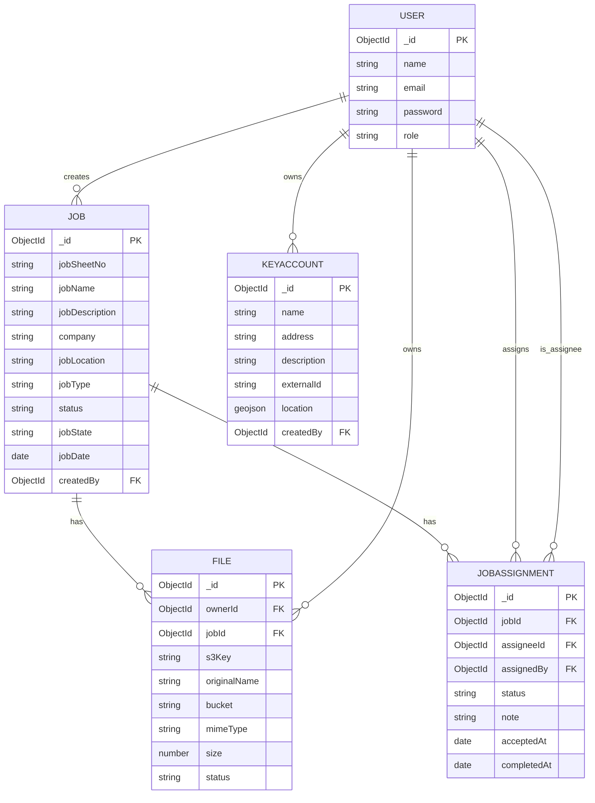
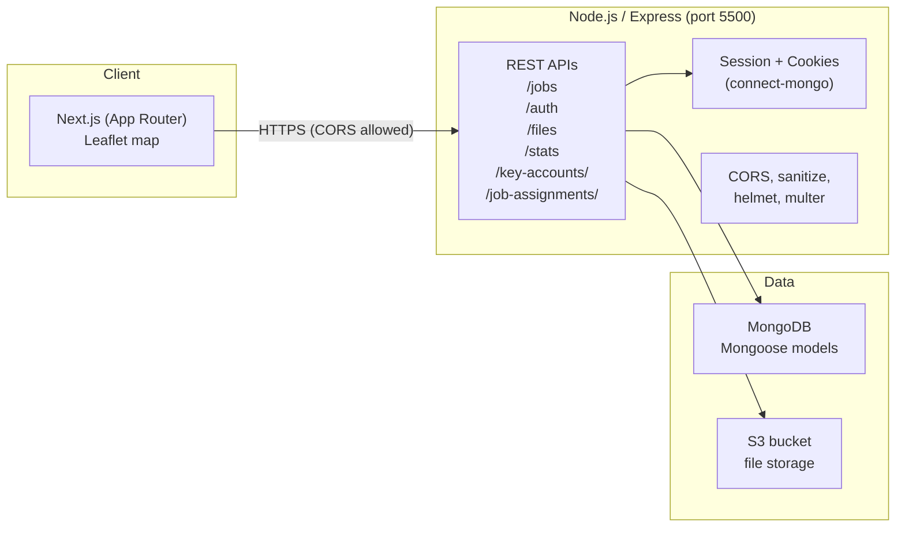

## Database Structure (Mermaid ER Diagram)

```mermaid
erDiagram
  USER {
    ObjectId _id PK
    string name
    string email
    string password
    string role
  }
  JOB {
    ObjectId _id PK
    string jobSheetNo
    string jobName
    string jobDescription
    string company
    string jobLocation
    string jobType
    string status
    string jobState
    date jobDate
    ObjectId createdBy FK
  }
  FILE {
    ObjectId _id PK
    ObjectId ownerId FK
    ObjectId jobId FK
    string s3Key
    string originalName
    string bucket
    string mimeType
    number size
    string status
  }
  KEYACCOUNT {
    ObjectId _id PK
    string name
    string address
    string description
    string externalId
    geojson location
    ObjectId createdBy FK
  }
  JOBASSIGNMENT {
    ObjectId _id PK
    ObjectId jobId FK
    ObjectId assigneeId FK
    ObjectId assignedBy FK
    string status
    string note
    date acceptedAt
    date completedAt
  }

  USER ||--o{ JOB : creates
  JOB ||--o{ FILE : has
  USER ||--o{ FILE : owns
  USER ||--o{ KEYACCOUNT : owns
  JOB ||--o{ JOBASSIGNMENT : has
  USER ||--o{ JOBASSIGNMENT : assigns
  USER ||--o{ JOBASSIGNMENT : is_assignee
```

## Software Architecture (Mermaid Flow)

```mermaid
flowchart LR
  subgraph Client
    NX["Next.js (App Router)\nLeaflet map"]
  end

  subgraph Backend["Node.js / Express (port 5500)"]
    API["REST APIs\n/jobs\n/auth\n/files\n/stats\n/key-accounts/\n/job-assignments/"]
    Session["Session + Cookies\n(connect-mongo)"]
    Middleware["CORS, sanitize,\nhelmet, multer"]
  end

  subgraph Data
    DB["MongoDB\nMongoose models"]
    S3["S3 bucket\nfile storage"]
  end

  NX -->|"HTTPS (CORS allowed)"| API
  API --> Session
  API --> DB
  API --> S3
```
