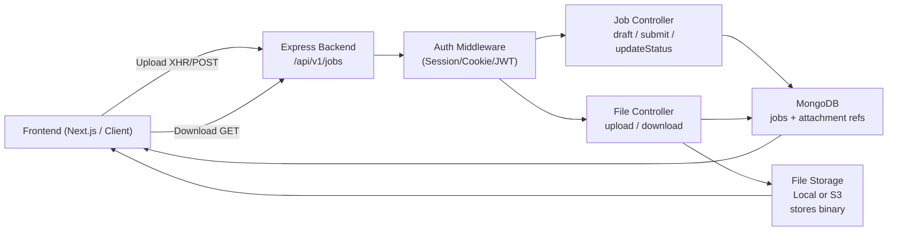

## File Storage Flow (Mermaid)

```mermaid
flowchart LR
  FE["Frontend (Next.js / Client)"]
  API["Express Backend<br>/api/v1/jobs"]
  AUTH["Auth Middleware<br>(Session/Cookie/JWT)"]
  JOB["Job Controller<br> draft / submit / updateStatus"]
  FILE["File Controller<br>upload / download"]
  DB["MongoDB<br>jobs + attachment refs"]
  STORE["File Storage<br>Local or S3<br>stores binary"]

  FE -->|Upload XHR/POST| API
  FE -->|Download GET| API

  API --> AUTH
  AUTH --> JOB
  AUTH --> FILE

  JOB --> DB
  FILE --> DB
  FILE --> STORE

  STORE --> FE
  DB --> FE
```
